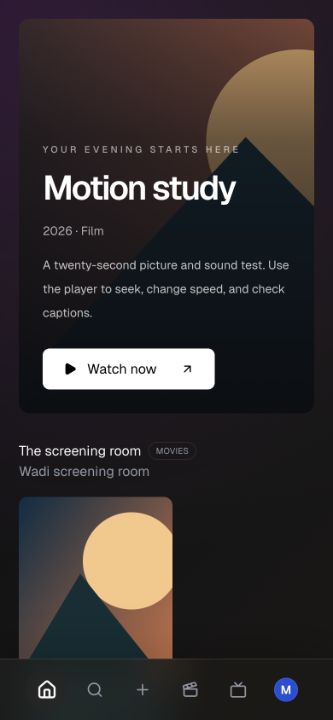
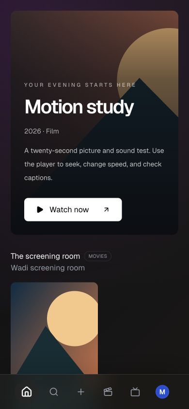
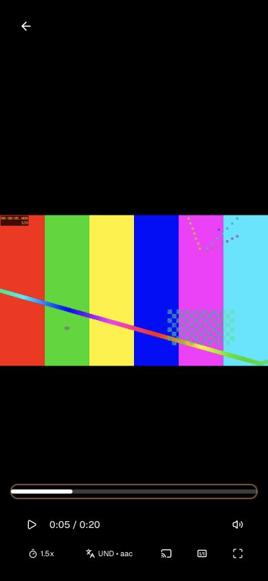

# Playback verification

Checked on 9 September 2026 with Node 24.14.0 and the generated local H.264/AAC screening-room addon.

## Automated checks

- Frontend TypeScript production build passed.
- Frontend ESLint passed without warnings.
- 60 frontend tests passed, including the Google Cast sender contract tests, subtitle parsing and preference tests, and the existing library tests.
- Two Node integration tests passed. They use actual HTTP servers and SQLite, covering registration, login, logout, authorization, profile isolation, Saved list protections, list items, watch progress, addon installation and aggregation, byte-range streaming, player preferences and a persistent database restart.
- `git diff --check` passed.

The production build still reports a main-bundle size warning. The 431 kB player bundle is loaded only when playback opens.

## Browser checks

Using the actual frontend and Node backend:

1. Registered a disposable account through the UI.
2. Previewed and installed the local addon through account settings.
3. Opened the catalog, film details and stream.
4. Observed decoded video, advancing time and captions through the authenticated media/subtitle proxies.
5. Paused and sought to 0:00 and 0:05. Confirmed the decoded frame's embedded timestamp reached 0:05.
6. Changed playback speed to 1.5x and turned captions off.
7. Returned to the library and observed Continue Watching with saved progress. Playback completion also marked the film watched.
8. Verified library and player at desktop width and at 390 × 844. Fixed a poster-row overflow; the mobile document and viewport now both measure 390 px.
9. Fixed the mobile time display and placed secondary controls on a separate row.

The preview browser crashed once during viewport resizing after hot reload. A fresh tab recovered; mobile playback and seeking were then checked successfully. This run is a short fixture test, not a long-duration playback soak.

## Limits of this verification

The Cast tests substitute the SDK because no physical receiver was exercised. They verify the default receiver ID, load URL, resume time, subtitle tracks, pause/seek commands, and rejection of loopback URLs and receiver load errors. They do not prove television playback or discoverability on a user's LAN.

The fixture uses a single H.264 video track and AAC audio track. Other codecs, multi-track media, third-party addon availability and network conditions were not exhaustively tested. There is no server transcoding or torrent engine.

## Screenshots

